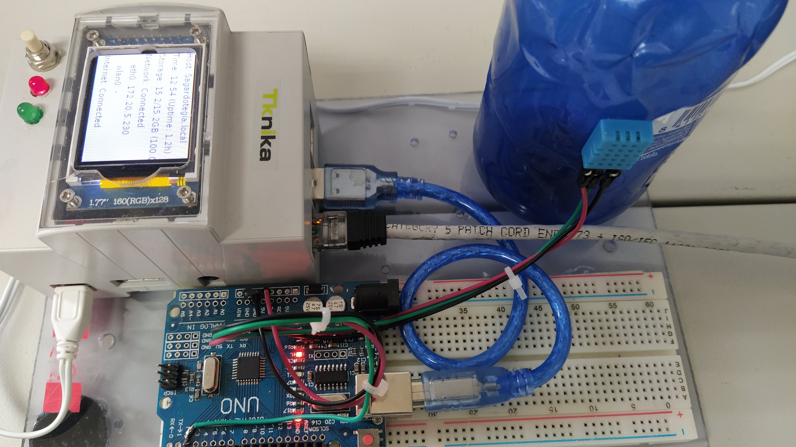
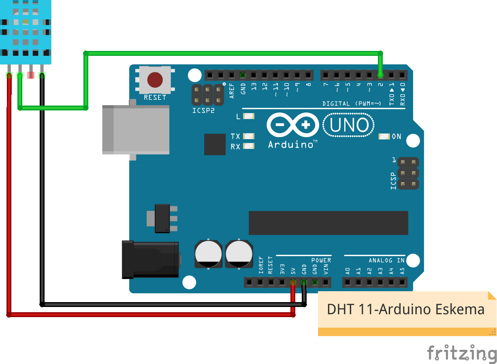
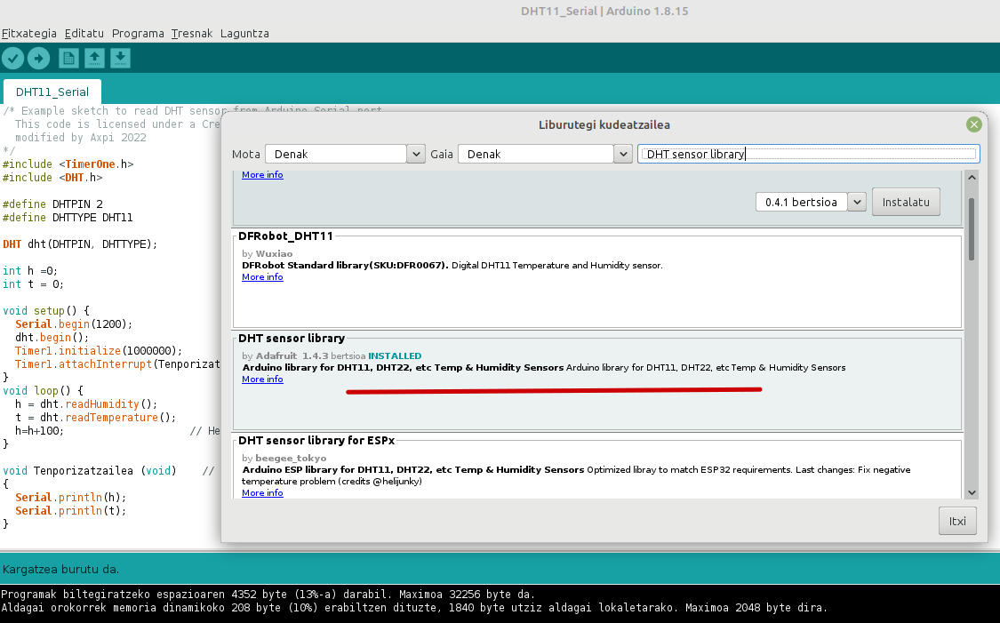
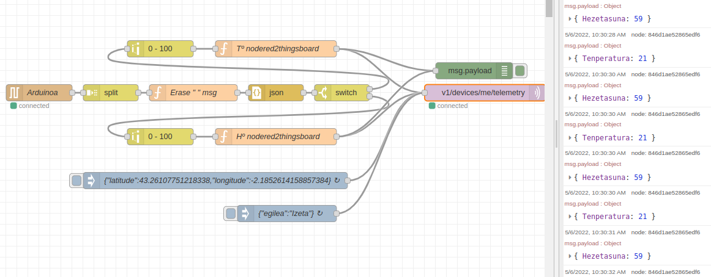
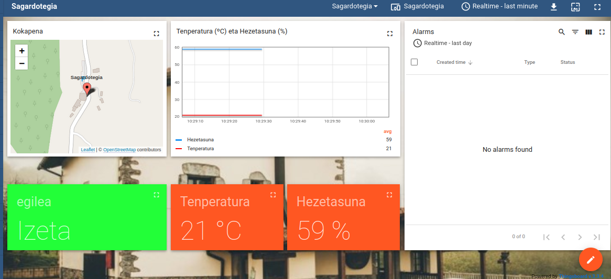

# Sagardotegia

## Sarrera

**Oteitza Sagardotegia** edozein jariakinen Tº eta Hº -aren urruneko monitorizazio eta kontrola **Arduino eta Thingsboard** bitartez egiteko gida da. 


## Eskema Elektrikoa



## Arduino programazioa

Arduino IDE-a erabiliaz errepositorioan emanda dagoen **arduino-DHT11-Serial-Kodea.ino** kodea Arduino UNO-ra igo. 

Some basic Git commands are:
```c
#include <TimerOne.h>
#include <DHT.h>
#define DHTPIN 2
#define DHTTYPE DHT11
DHT dht(DHTPIN, DHTTYPE);
int h =0;
int t = 0;

void setup() {
  Serial.begin(1200);
  dht.begin();
  Timer1.initialize(1000000);      //Tenporizadorea 1sg
  Timer1.attachInterrupt(Tenporizatzailea) ; //Interrupzioa konfiguratu
}

void loop() {
  h = dht.readHumidity();
  t = dht.readTemperature();
  h=h+100;                    // Hezetasuna 100 etik gorako balioetan modulatua bidaliko da
}

void Tenporizatzailea (void)    // 1 sgko serial monitoretik Tº eta Hº balioak bidali
{ 
  Serial.println(h);
  Serial.p
```


Kontuan izan Library Manager-a erabiliaz **DHT sensor library**-a instalatu beharko duzuela lehendabizi.




## Node Red

Node Red-en Arduinotik datozen **SERIE** datuak irakurri, modelatu, Thingsboard **{"key":value}** formatuan jarri eta MQTT bitartez Thingsboard-en publikatu beharko ditugu.



## Thingsboard

Thingsboard-en telemetriak irakurri, Dasboard batean irudikatu eta alarmak progamatu beharko ditugu.




## Elementuen lista
|Elements| Quantity | Link | 
|---|---|---|
| IoMbian| 1 | |
| Arduino UNO| 1 |[Electroson](https://www.electrosonsansebastian.com/eu/placas-de-desarrollo/1327-arduino-uno-rev3.html)|
| DHT11| 1 ||
| Female-Female headers| 3 ||

> **Warning**: Try to buy locally ```nearest store```.

## Node Red eta Thingsboard
**Node Red** eta **Thingsboard** erabili Arduino datuak irakurri eta ondoren metatu eta bistaratzeko. 

## Authors

(c) 2020 [Tknika](https://tknika.eus/)  [Aitor Azpiroz](https://github.com/axpirina))

Licensed under the Apache License, Version 2.0 (the "License");
you may not use this file except in compliance with the License.
You may obtain a copy of the License at

    http://www.apache.org/licenses/LICENSE-2.0

Unless required by applicable law or agreed to in writing, software
distributed under the License is distributed on an "AS IS" BASIS,
WITHOUT WARRANTIES OR CONDITIONS OF ANY KIND, either express or implied.
See the License for the specific language governing permissions and
limitations under the License.
